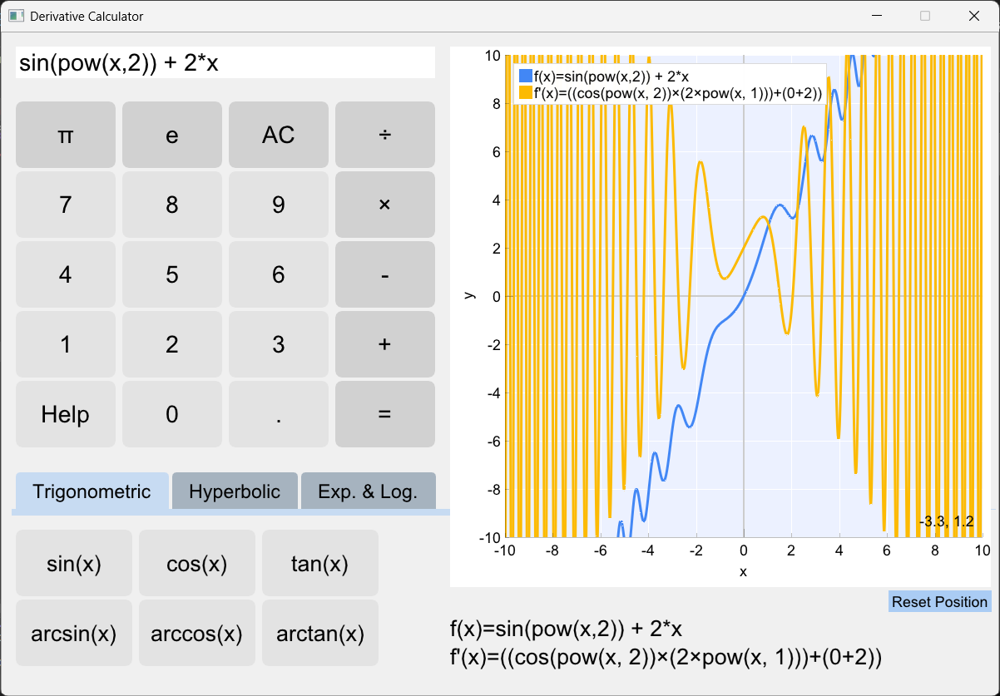

# Derivative Calculator

## Description
The Derivative Calculator is a desktop application developed in C++ that allows users to parse mathematical equations, calculate their derivatives, and visualize both functions simultaneously in real-time. The project utilizes the Dear ImGui framework for the graphical user interface and the ImPlot library for rendering mathematical graphs. Under the hood, it implements a custom mathematical engine based on Reverse Polish Notation (RPN) and an Abstract Syntax Tree (AST) to process inputs, apply symbolic differentiation rules, and algebraically simplify the resulting expressions.

## Installation
To compile and run this project, you need a standard C++ development environment. 

### Prerequisites
* C++17 Standard or higher.
* IDE: Visual Studio 2022 (recommended for Windows users) or any compatible C++ compiler.
* Dependencies: The project requires the `Dear ImGui` and `ImPlot` libraries. (Note: Ensure that the include directories and linkers for these libraries are properly configured in your project properties if they are not already bundled).

## Usage
This application is highly useful for students, educators, and engineers who need to quickly visualize mathematical functions and analyze their rate of change (derivatives). 

To use the calculator, simply interact with the on-screen keyboard or use your physical keyboard to type a valid mathematical function in terms of the independent variable `x`. The application will instantly parse the formula, generate the derivative, and plot both lines. You can freely pan the camera by clicking and dragging the graph, or zoom in and out using the mouse wheel. An integrated "Help" menu is available within the application.

## Examples
A standard use case involves analyzing complex trigonometric and polynomial bounds. For instance, inputting the formula `sin(pow(x, 2)) + 2 * x` will automatically compute the exact derivative `cos(pow(x, 2)) * 2 * x + 2` (simplified through the AST engine) and display their respective intersections on the graph.

## Features
* **Custom AST Parsing Engine:** Converts standard infix mathematical notation into Reverse Polish Notation and builds a traversable syntax tree.
* **Symbolic Differentiation:** Dynamically applies the chain rule, product rule, and quotient rule to calculate exact derivatives instead of relying on numerical approximations.
* **Algebraic Simplification:** Automatically reduces mathematical clutter (e.g., multiplying by zero or one) for cleaner derivative output.
* **Real-Time Graphing:** Rendering of multiple functions using ImPlot.
* **Comprehensive Math Support:** Supports basic arithmetic, trigonometry, cyclometric functions, hyperbolic functions, logarithms, powers and natural constants (π, e).
* **Robust Error Handling:** Instantly detects parsing errors, missing brackets, or invalid syntax and alerts the user through the UI without crashing the application.